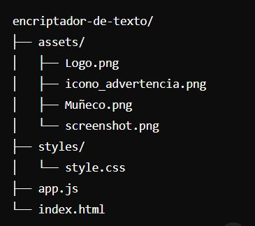

# Encriptador de Texto

## 📝 Descripción

El **Encriptador de Texto** es una aplicación web que permite encriptar y desencriptar texto siguiendo reglas específicas. Esta herramienta es ideal para aquellos que desean mantener su información segura de una manera sencilla y efectiva.

## 🚀 Funcionalidades

- ✨ **Encriptar Texto**: Convierte texto normal en una versión encriptada.
- 🔓 **Desencriptar Texto**: Convierte texto encriptado de vuelta a su forma original.
- 📋 **Copiar al Portapapeles**: Permite copiar el texto encriptado o desencriptado para un uso fácil y rápido.

## 📚 Lengiajes de programación

- HTML5
- CSS3
- JavaScript

## 💻 Uso

- Ingresa el texto que deseas encriptar o desencriptar en el área de texto.
- Haz clic en el botón correspondiente para encriptar o desencriptar el texto.
- Copia el resultado utilizando el botón de copiar.

## 📂 Estructura del Proyecto

## 📄 Licencia

MIT License

Copyright (c) 2024 Johana Sevillano

Permission is hereby granted, free of charge, to any person obtaining a copy
of this software and associated documentation files (the "Software"), to deal
in the Software without restriction, including without limitation the rights
to use, copy, modify, merge, publish, distribute, sublicense, and/or sell
copies of the Software, and to permit persons to whom the Software is
furnished to do so, subject to the following conditions:

The above copyright notice and this permission notice shall be included in all
copies or substantial portions of the Software.

THE SOFTWARE IS PROVIDED "AS IS", WITHOUT WARRANTY OF ANY KIND, EXPRESS OR
IMPLIED, INCLUDING BUT NOT LIMITED TO THE WARRANTIES OF MERCHANTABILITY,
FITNESS FOR A PARTICULAR PURPOSE AND NONINFRINGEMENT. IN NO EVENT SHALL THE
AUTHORS OR COPYRIGHT HOLDERS BE LIABLE FOR ANY CLAIM, DAMAGES OR OTHER
LIABILITY, WHETHER IN AN ACTION OF CONTRACT, TORT OR OTHERWISE, ARISING FROM,
OUT OF OR IN CONNECTION WITH THE SOFTWARE OR THE USE OR OTHER DEALINGS IN THE
SOFTWARE.

🙋‍♂️ Autor
Johana Sevillano - [LinkedIn](www.linkedin.com/in/johanasevillano) | [GitHub](https://github.com/johanasev)

